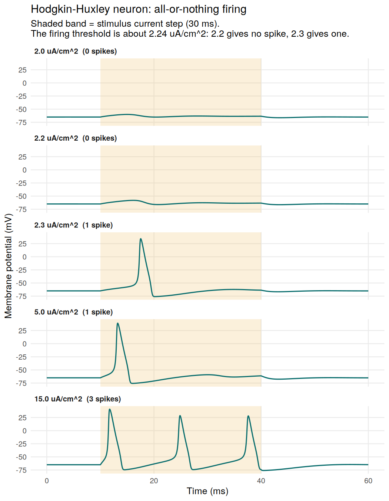
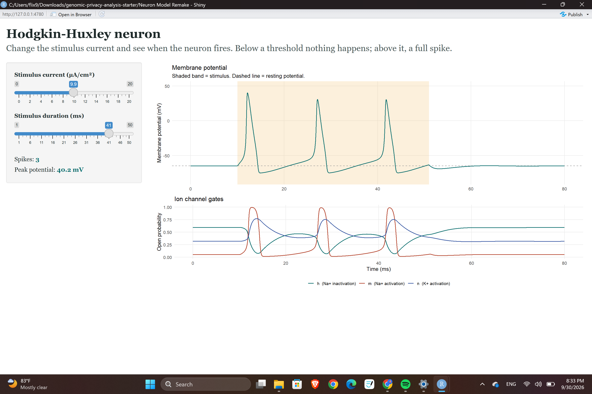

# Hodgkin-Huxley Neuron Model in R

An R implementation of the Hodgkin-Huxley model of the squid giant axon, with an interactive app for exploring how a neuron responds to a stimulus current.

This project rebuilds a model I first made in Excel as an undergraduate graduation project, where I plotted the action potential and used an adjustable bar to change the stimulus current and see the exact point at which the neuron fires. Here it is rewritten in R with differential equation solvers, reproducible figures, and a slider-based app.




## What it shows

- **A sharp threshold.** With a 30 ms current step, a stimulus of 2.2 µA/cm² produces no spike, while 2.3 µA/cm² produces a full one. The threshold is about 2.24 µA/cm².
- **All-or-nothing firing.** Once the neuron fires, the spike reaches about the same height regardless of how strong the stimulus is (peak about 34 to 41 mV in these runs).
- **Repetitive firing.** Stronger currents drive multiple spikes (2 spikes at 7 µA/cm², 3 at 15 µA/cm²).
- **Channel dynamics.** The app plots the sodium activation (m), sodium inactivation (h), and potassium activation (n) gates alongside the voltage, so you can see why the spike rises and falls.

## The model

Four coupled first-order differential equations:

```
C_m dV/dt = I_ext - g_Na m³ h (V - E_Na) - g_K n⁴ (V - E_K) - g_L (V - E_L)
dm/dt = α_m(V) (1 - m) - β_m(V) m
dh/dt = α_h(V) (1 - h) - β_h(V) h
dn/dt = α_n(V) (1 - n) - β_n(V) n
```

| Parameter | Value |
|---|---|
| Membrane capacitance C_m | 1 µF/cm² |
| Max sodium conductance g_Na | 120 mS/cm² |
| Max potassium conductance g_K | 36 mS/cm² |
| Leak conductance g_L | 0.3 mS/cm² |
| Sodium reversal potential E_Na | 50 mV |
| Potassium reversal potential E_K | -77 mV |
| Leak reversal potential E_L | -54.387 mV |

Voltage is in the modern convention (resting potential about -65 mV). The rate functions have removable singularities at V = -55 mV and V = -40 mV, which the code handles with their limiting values.

## Run it

Requires R with the `deSolve`, `ggplot2`, and `shiny` packages.

```r
install.packages(c("deSolve", "ggplot2", "shiny"))

# Interactive app (from this folder)
shiny::runApp()

# Regenerate the threshold figure
source("threshold_demo.R")
```

## Files

| File | Purpose |
|---|---|
| `hodgkin_huxley.R` | The model: rate functions, differential equations, simulation, spike counting |
| `app.R` | Shiny app with stimulus current and duration sliders |
| `threshold_demo.R` | Script that generates the figure above |
| `figures/threshold_demo.png` | Output of the figure script |

## Possible extensions

- Add a current-frequency (f-I) curve showing firing rate against stimulus current.
- Compare numerical solvers (for example `lsoda` against a fixed-step Runge-Kutta method) for accuracy and speed.
- Add temperature dependence of the gating rates.
- Model a simple drug effect by scaling the sodium or potassium conductances.

## Reference

Hodgkin AL, Huxley AF. A quantitative description of membrane current and its application to conduction and excitation in nerve. *J Physiol.* 1952;117(4):500-544.
